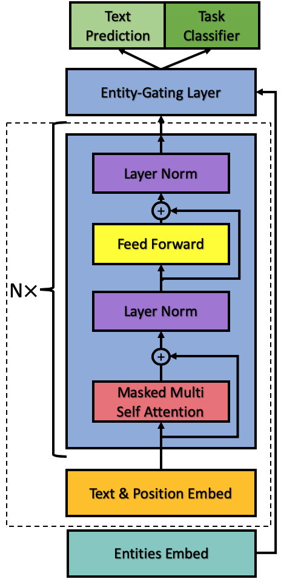

# GPT-2 Transformer Model for NLP Tasks
This repository contains an implementation of the GPT-2 Transformer Model for Natural Language Processing (NLP) tasks. The GPT-2 model is a state-of-the-art language model that has been pre-trained on a massive corpus of text data and can be fine-tuned for various NLP tasks, such as text generation, sentiment analysis, and language translation.

The code in this repository allows you to train the GPT-2 model on your own dataset and fine-tune it for your specific NLP task. You can specify the model hyperparameters, such as the number of layers, the number of heads, and the embedding dimension, and train the model using the Adam optimizer and Cross Entropy loss. The model can be trained on a CPU or a GPU depending on your hardware resources.

                                               

To use this code, you need to provide a text dataset in a plain text format. The code will preprocess the dataset by tokenizing the text and creating a vocabulary of unique tokens. Then, it will divide the dataset into chunks of a specified size and create a PyTorch DataLoader to feed the chunks into the model during training.

Once the model is trained, you can use it to generate text or predict the labels of your NLP task. You can also save the trained model and load it later for further fine-tuning or prediction.

This repository includes sample code for training the model on the Shakespeare text dataset and generating text using the trained model. You can use this code as a starting point for your own NLP task and customize it to fit your needs.

We hope this repository will be useful for researchers and developers who want to use the GPT-2 model for their NLP tasks. If you have any questions or feedback, please feel free to open an issue or contact us directly.


For every text generation task with a corpus dataset the training loss diminishing like this

## Install
Dependencies:
- [pytorch](https://pytorch.org) <3
- [numpy](https://numpy.org/install/) <3
- `pip install transformers` for huggingface transformers <3
- `pip install datasets` for huggingface datasets <3
- `pip install tqdm` <5

Also for other dependencies you can install them with run command:
```
$ pip install -r requirements.txt
```

## Train
You can train the architecture on your own dataset in txt format with this command:
```
$ python train.py --file_path "path of your txt dataset" --embed_dim 512 --chunk_size 512 --num_layers 6 --batch_size 20 --num_epochs 1000
```
you also can alter other parameters like embed dim , chunk size or number of layers with replace the front number with what you want

